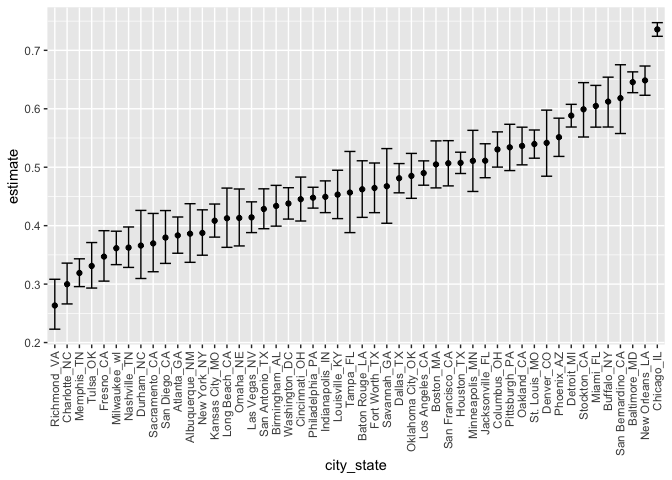
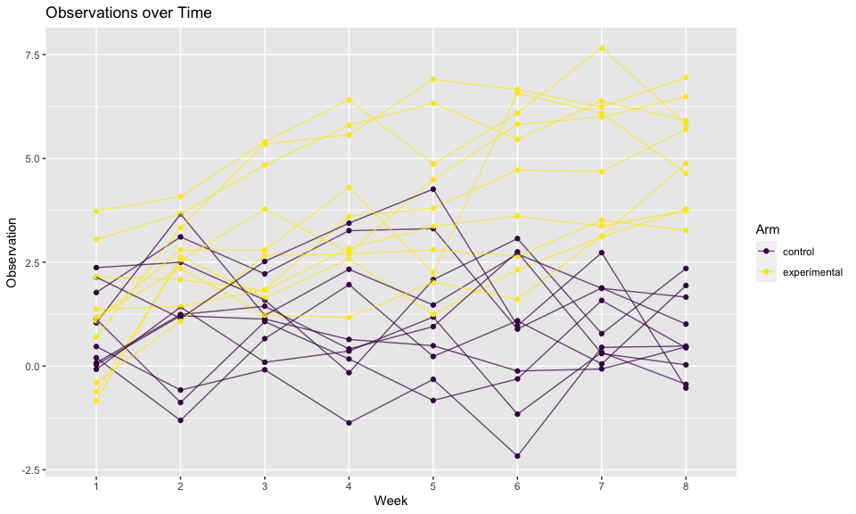
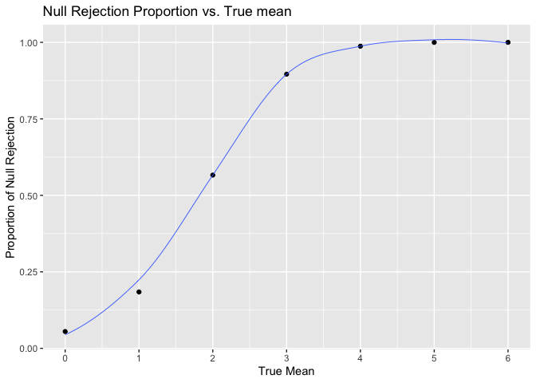
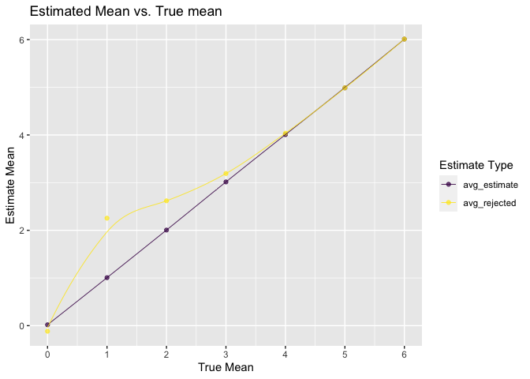

Homework 5
================
Beibei Cao
2020-11-17

## Problem 1

Read in the data.

``` r
homicide_df = 
  read_csv("homicide_data/homicide-data.csv") %>% 
  mutate(
    city_state = str_c(city, state, sep = "_"),
    resolved = case_when(
      disposition == "Closed without arrest" ~ "unsolved",
      disposition == "Open/No arrest"        ~ "unsolved",
      disposition == "Closed by arrest"      ~ "solved",
    )
  ) %>% 
  select(city_state, resolved) %>% 
  filter(city_state != "Tulsa_AL")
```

Let’s look at this a bit

``` r
aggregate_df = 
  homicide_df %>% 
  group_by(city_state) %>% 
  summarize(
    hom_total = n(),
    hom_unsolved = sum(resolved == "unsolved")
  )
```

Can I do a prop test for a single city?

``` r
prop.test(
  aggregate_df %>% filter(city_state == "Baltimore_MD") %>% pull(hom_unsolved), 
  aggregate_df %>% filter(city_state == "Baltimore_MD") %>% pull(hom_total)) %>% 
  broom::tidy()
```

    ## # A tibble: 1 x 8
    ##   estimate statistic  p.value parameter conf.low conf.high method    alternative
    ##      <dbl>     <dbl>    <dbl>     <int>    <dbl>     <dbl> <chr>     <chr>      
    ## 1    0.646      239. 6.46e-54         1    0.628     0.663 1-sample… two.sided

Try to iterate ……..

``` r
results_df = 
  aggregate_df %>% 
  mutate(
    prop_tests = map2(.x = hom_unsolved, .y = hom_total, ~prop.test(x = .x, n = .y)),
    tidy_tests = map(.x = prop_tests, ~broom::tidy(.x))
  ) %>% 
  select(-prop_tests) %>% 
  unnest(tidy_tests) %>% 
  select(city_state, estimate, conf.low, conf.high)
```

``` r
results_df %>% 
  mutate(city_state = fct_reorder(city_state, estimate)) %>% 
  ggplot(aes(x = city_state, y = estimate)) +
  geom_point() + 
  geom_errorbar(aes(ymin = conf.low, ymax = conf.high)) + 
  theme(axis.text.x = element_text(angle = 90, vjust = 0.5, hjust = 1))
```

<!-- -->

``` r
city_prop_test = function(df) {
  
  n_unsovled ...
  n_total ... 
  
  prop.test(.....)
  
}
homicide_df = 
  read_csv("homicide_data/homicide-data.csv") %>% 
  mutate(
    city_state = str_c(city, state, sep = "_"),
    resolved = case_when(
      disposition == "Closed without arrest" ~ "unsolved",
      disposition == "Open/No arrest"        ~ "unsolved",
      disposition == "Closed by arrest"      ~ "solved",
    )
  ) %>% 
  select(city_state, resolved) %>% 
  filter(city_state != "Tulsa_AL") %>% 
  nest(data = resolved)
```

    ## Error: <text>:3:14: unexpected symbol
    ## 2:   
    ## 3:   n_unsovled ...
    ##                 ^

## Problem 2

Import and tidy the data from each file.

``` r
study_df = 
  # get file paths
  tibble(
    path = list.files("lda_data"),
  ) %>%
  # read each file 
  mutate(
    subject = str_remove(path, '.csv'),
    path = str_c("lda_data/", path),
    data = map(.x = path, ~read_csv(.x))
    ) %>% 
  # tidy data
  separate(subject, c("arm", "id")) %>% 
  mutate(
    arm = recode(arm, con = "control", exp = "experimental"),
    id = as.integer(id)
         ) %>%
  unnest(data) %>% 
  select(-path) %>% 
  # transform into tidy (long) format 
  pivot_longer(
    week_1:week_8,
    names_prefix = "week_",
    names_to = "week",
    values_to = "observation"
  ) 

# preview
study_df
```

    ## # A tibble: 160 x 4
    ##    arm        id week  observation
    ##    <chr>   <int> <chr>       <dbl>
    ##  1 control     1 1            0.2 
    ##  2 control     1 2           -1.31
    ##  3 control     1 3            0.66
    ##  4 control     1 4            1.96
    ##  5 control     1 5            0.23
    ##  6 control     1 6            1.09
    ##  7 control     1 7            0.05
    ##  8 control     1 8            1.94
    ##  9 control     2 1            1.13
    ## 10 control     2 2           -0.88
    ## # … with 150 more rows

Make a spaghetti plot showing observations on each subject over time.

``` r
study_df %>% 
  # plot observation vs. time for each subject (point + line)
  ggplot(aes(x = week, y = observation, group = interaction(arm, id), color = arm)) +
  geom_point() + 
  geom_line(alpha = 0.7) +
  labs(
    title = "Observations vs. Time",
    x = "Week",
    y = "Observation",
    color = "Arm"
  )
```

<!-- -->

It could be observed from the plot that the experimental group subjects
generally have higher observations compared with the control group.
There is also an increasing trend in the observations of the
experimental group while the observations in the control group are more
stable across the 8 weeks.

# Problem 3

Build functions for the simulation.

``` r
# function for a single trial of simulation with t-test
sim_norm_test = function(n = 30, mu = 0, sigma = 5) {
  x = rnorm(n, mean = mu, sd = sigma)
  temp = 
    t.test(x, mu = 0) %>% 
    broom::tidy() %>% 
    select(estimate, p.value) %>% 
    rename(mu_hat = estimate, p_value = p.value)
  return(temp)
}

# function for multiple trials
mutiple_test = function(trial = 5000, n = 30, mu = 0, sigma = 5){
  output = vector("list", trial)
  for (i in 1:trial) {
    output[[i]] = sim_norm_test(n, mu, sigma)
  }
  res = bind_rows(output)
  return(res)
}

# function to calculate rejection proportion 
rej_prop = function(res){
  prop = 
    res %>% 
    filter(p_value < 0.05) %>% 
    count()/nrow(res)
  
  return(prop$n)
}

# function to calculate average estimates and everage rejected estimates
get_avg = function(res){
  avg = tibble(
    avg_estimate = mean(res$mu_hat),
    avg_rejected = mean(res$mu_hat[res$p_value < 0.05])
  )
  return(avg)
}
```

Simulate (set μ from `0-6`, test against null hypothesis μ = 0).

``` r
set.seed(100)
res = 
  # set mu 0-6
  tibble(mu = seq(0,6)) %>% 
  mutate(
    # generate simulation data (5000 sample each)
    data = map(.x = mu, ~mutiple_test(mu = .x)),
    # calculated rejection proportion
    rej_prop = map(.x = data, ~rej_prop(.x)),
    # get average estimates for all samples and average estimates for samples with null rejected
    avg = map(.x = data, ~get_avg(.x))
    ) %>%
  # tidy the df
  unnest(rej_prop, avg)
```

Check results.

``` r
res %>% unnest(data)
```

    ## # A tibble: 35,000 x 6
    ##       mu mu_hat p_value rej_prop avg_estimate avg_rejected
    ##    <int>  <dbl>   <dbl>    <dbl>        <dbl>        <dbl>
    ##  1     0  0.144   0.823    0.055       0.0183       -0.117
    ##  2     0  0.463   0.667    0.055       0.0183       -0.117
    ##  3     0 -0.219   0.827    0.055       0.0183       -0.117
    ##  4     0 -0.375   0.680    0.055       0.0183       -0.117
    ##  5     0 -0.796   0.259    0.055       0.0183       -0.117
    ##  6     0  0.838   0.240    0.055       0.0183       -0.117
    ##  7     0 -0.358   0.688    0.055       0.0183       -0.117
    ##  8     0 -0.546   0.505    0.055       0.0183       -0.117
    ##  9     0  0.323   0.779    0.055       0.0183       -0.117
    ## 10     0  0.974   0.247    0.055       0.0183       -0.117
    ## # … with 34,990 more rows

Make a plot showing the proportion of times the null was rejected (the
power of the test) on the y axis and the true value of μ (the effect
size) on the x axis.

``` r
res %>% 
  ggplot(aes(x = mu, y = rej_prop)) +
  geom_point() +
  geom_smooth(size = 0.3, se = FALSE) +
  labs(
    title = "Null Rejection Proportion vs. True mean",
    x = "True Mean",
    y = "Proportion of Null Rejection"
    ) +
  scale_x_continuous(
    breaks = c(seq(0, 6)),
    labels = c(seq(0, 6))
  ) 
```

<!-- -->

It could be observed from the plot that the effect size significantly
effect the power. As the effect size deviating from 0, the power
(proportion of rejected null hypothesis) increases, which makes sense
because the true mean now indeed is not 0 and the null should be
rejected more and more likely as the differences get larger. When the
difference is large enough, the power approaches 1.0.

Make a plot showing the average estimate of μ̂ (of all samples and of
null hypothesis rejected samples) on the y axis and the true value of μ
on the x axis.

``` r
res %>% 
  # transofrm into long format to facilitate plotting
  pivot_longer(
    avg_estimate:avg_rejected,
    names_to = "estimate_type",
    values_to = "estimate_value"
  ) %>%
  # plot for both average estimates
  ggplot(aes(x = mu, y = estimate_value, color = estimate_type)) +
  geom_point(alpha = 0.7) +
  geom_smooth(size = 0.3, se = FALSE) +
  labs(
    title = "Estimated Mean vs. True mean",
    x = "True Mean",
    y = "Estimate Mean",
    color = "Estimate Type"
    ) +
  scale_x_continuous(
    breaks = c(seq(0, 6)),
    labels = c(seq(0, 6))
  ) 
```

<!-- -->

In this plot, the average estimate of sample means across all 5000
samples all nicely approximate the true means. However, it could be
observed that the sample averages of μ̂ across tests for which the null
is rejected `deviates` more from the true value of μ when the true value
of μ is actually close to the 0 (which is the value we set in the null
hypothesis), and `get closer` to the true mean when the true mean
differs more from the null. It makes sense because when the true mean is
closer to the null, the cases get rejected are more of extreme samples
that deviates even more from the true mean, while when the true mean is
drastically different from the null, most cases will be rejected and the
means of these samples average μ̂ will just approximate the true mean.
As for the case of true mean 0, since it equals null hypothesis, while
the rejected samples are still extreme cases, the sample average μ̂ of
these cases equally distributed on the two side of 0. Therefore the
estimated average of μ̂ across tests for which the null is rejected for
this case is still 0.
